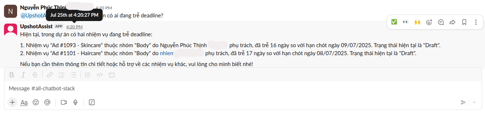

# 🤖 Task Management Agent (Slack + Monday + Box)

This agent is built to **manage tasks on Monday.com**, **analyze data from Box**, and **integrate directly into Slack** as a chatbot.
The bot can answer all questions related to project progress, deadlines, data, and real-time reports.

---

## 🚀 Key Features

* **Task Management on Monday**

  * Retrieve task lists, deadlines, and statuses.
  * Delay alerts and task prioritization suggestions.

* **Data Analysis from Box**

  * Utilize `pandasai` for data processing.
  * Support natural language queries (NLQ).

* **Slack-integrated Chatbot**

  * Directly respond to questions in Slack.
  * Automatically summarize project information.

* **Supported LLMs**

  * [Azure OpenAI](https://azure.microsoft.com/en-us/products/cognitive-services/openai-service/)
  * [Google Gemini](https://deepmind.google/technologies/gemini/)

---

## 🛠️ Technologies Used

* [LangGraph](https://www.langchain.com/langgraph) – Workflow orchestration framework for LLM Agents.
* [pandasai](https://github.com/gventuri/pandas-ai) – Data analysis with Python + LLM.
* [FastAPI](https://fastapi.tiangolo.com/) – API backend framework.
* Slack API, Monday API, Box API.
* Python **3.11+**

---

## ⚙️ Environment Configuration

Create a `.env` file from the template:

```bash
cp .env.example .env
```

Fill in the API keys and tokens for:

* Slack API
* Monday API
* Box API
* Azure OpenAI / Google Gemini

---

## 📦 Installation & Run (Production Ready)

### 1. Clone the source code

```bash
git clone https://github.com/your-org/task-agent.git
cd task-agent
```

### 2. Create a virtual environment

Recommended: use `venv` or `conda`:

```bash
python3.11 -m venv venv
source venv/bin/activate   # Linux/MacOS
venv\Scripts\activate      # Windows
```

### 3. Install dependencies

```bash
pip install --upgrade pip
pip install -r requirements.txt
```

### 4. Setup environment variables

```bash
cp .env.example .env
nano .env   # update with correct values
```

### 5. Run the application (local)

```bash
python main.py
```
📷 Example Screenshot

Below is an example of the Slack chatbot in action: 
